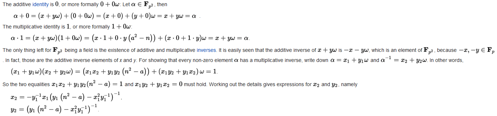

<!-- less -->

## 二次剩余

### 定义

对于$P, n$ 如果存在$x$使得 $x^2 \equiv n \mod P$ 则称$n$是模$P$意义下的二次剩余

### 定理

对于$x^2\equiv n(mod p)$ 总共有$\frac{p-1}{2}$ 个n能使得方程有解

#### 证明

考虑所有的$x^2$ ,如果存在两个不同的数字$1< u,v < p$,$u^2\equiv v^2(\mod p)$ ,那么显然$(u^2-v^2)\mod p==0$

即$(u+v)(u-v)\mod p == 0$ ，那么就只能是$u+v\equiv 0(\mod p)$，两个数字相互对应，所有共有$\frac{p-1}{2}$个不同的平方

## 勒让德符号

### 定义

 $(\frac{a}{p})= \begin{cases} 1, & a在模p意义下是二次剩余\\ -1，& a在模p意义下是非二次剩余 \\ 0, & a\equiv 0 (mod p) \end{cases}$ 

### 定理

$(\frac{a}{p})\equiv a^{\frac{p-1}{2}}(\mod p)$

#### 证明

1.若$a$是模p下的二次剩余，那么存在$x^2\equiv a (\mod p)$ ,那么$x^{p-1}\equiv a^{\frac{p-1}{2}}\equiv (\frac{a}{p})\equiv 1(\mod p)$ 根据费马小定理

在$a$是模$p$意义下的二次剩余时$x^{p-1} \equiv 1(\mod p)$显然成立

2.若$a$是模$p$意义下的非二次剩余,那么跟上面同理，显然不存在$x^{p-1}\equiv -1(\mod p)$

3.当$a\equiv 0(\mod p)$显然满足

## 开根复数域

我们先定义一个数域$\mathsf{F_p}$定义为$0$到$p-1$这$p$个数在模$p$意义下加减乘除构成的集合

数域$\mathsf{F_{p^2}}$定义为一个开根的复数域，即如果一个$a^2-n$不能开根$(勒让德符号(\frac{a}{p})=-1)$ ，那么我们加上一个复数域

就可以开根,(类似$\sqrt{-1}$我们加上一个复数域就可以开根)，我们另这个不能开根的数字$\sqrt{a^2-n}$为复数域的"虚数单位元"$(类似\sqrt{-1})$ 并设它为$w$ ,那么则任意一个复数域的数字都可以表示为$a+bw$($a$是实部，$b$是虚部，$w$是虚数单位元)  

$\mathsf{F_{p^2}}$数域满足不同复数域的所有四则运算

 

### 定理

$w^p\equiv -w(\mod p)$

#### 证明

$w^p\equiv w\cdot w^{p-1} \equiv w\cdot (w^2)^{\frac{p-1}{2}}\equiv w\cdot (a^2-n)^{\frac{p-1}{2}} \equiv -w (\mod p)$

### 定理

$(a+b)^n\equiv a^n+b^n(\mod n)(n \in P)$

#### 证明

有二项式定理可知: $(a+b)^n\equiv \sum\limits_{i=0}^{n}C_n^ia^ib^{n-i}(\mod n)$

因为n是一个质数，所以除了$i=0,i=n$时，其他的$C_n^i$是无法别消除这能模$p$模成$0$

## 二次剩余证明

我们首先随机出来一个$a$,使得$(\frac{a^2-n}{p})$为-1，也就是不能开根，然后我们把他定义为复数域的单位根

$w=\sqrt{a^2-n}$

那么我们求$x^2\equiv n(\mod p)$

$x^2\equiv n\equiv a^2-(a^2-n)\equiv a^2-w^2$

$\equiv (a-w)(a+w)\equiv (a^p+w^p)(a+w)(a满足费马小定理 a^{p-1}\equiv 1(\mod p))$

$\equiv (a+w)^p(a+w)\equiv (a+w)^{p+1}$

$所以x\equiv (a+w)^{\frac{p+1}{2}}$


## 代码

```c
struct T{
    long long p, d;
};

long long Ksm(long long a, long long b, long long p) {
    long long res = 1;
    while(b) {
        if(b & 1) res = res * a % p;
        a = a * a % p;
        b >>= 1;
    }
    return res;
}

long long w;
//二次域乘法
T Mul_er(T a, T b, long long p) {
    T ans;
    ans.p = (a.p * b.p + a.d * b.d % p * w % p) % p;
    ans.d = (a.p * b.d % p + a.d * b.p % p) % p;
    return ans;
}
//二次域快速幂
T Ksm_er(T a, long long b, long long p) {
    T ans;
    ans.p = 1; ans.d = 0;
    while(b) {
        if(b & 1) ans = Mul_er(ans, a, p);
        a = Mul_er(a, a, p);
        b >>= 1;
    }
    return ans;
} 
//求勒让德符号
long long Legendre(long long a, long long p) {
    return Ksm(a, (p-1)>>1, p);
}

long long Recever(long long a, long long p) {
    a %= p;
    if(a < 0) a += p;
    return a;
}

long long solve(long long n, long long p) {
    if(n % p == 0) return 0;
    if(p == 2) return 1;
    if(Legendre(n, p) + 1 == p) return -1;
    long long a = -1, t;
    while(1) {
        a = rand() % p;
        t = a * a - n;
        w = Recever(t, p);
        if(Legendre(w, p) + 1 == p) break;
    }
    T tmp;
    tmp.p = a; tmp.d = 1;
    T ans = Ksm_er(tmp, (p+1)>>1, p);
    return ans.p;
}
ll x = solve(n, p);
x==-1无解，否则
x和p-x都是合法解
```


