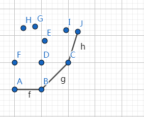
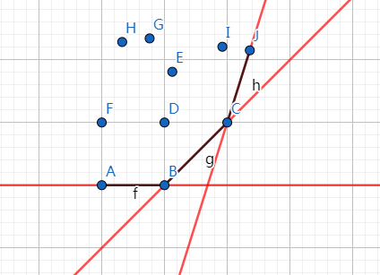

<!-- less -->

具体可以参考这篇博客https://www.cnblogs.com/Judge/p/9551035.html

## 简介

### 斜率

斜率优化$dp$，听名字就知道是用来优化$dp$的

当我们在推导$dp$公式的时候，如果我们推出来的$dp$转移方程类似为：

$dp[i] = \min\limits_{x=1}^{x<i}$  $or$  $\max\limits_{x=1}^{x<i}$ $\{dp[x] + f(x,i)\}$  $f(x,i)是一个关于x与i的函数$

拿去最小值来说

我们考虑两个决策点$k<j<i$并且$j$比$k$要优

我们我们可以列一个不等式 $dp[j]+f(j,i)\leq dp[k]+f(k,i)$

展开如果可以把式子化成类似$\frac{y_j-y_k}{x_j-x_k}\leq k_i$，那么我们如果如果把每个点$(x_i,y_i)$看成一个坐标，那么

就表示$(x_j,y_j)$与$(x_k,y_k)$的斜率$\leq k_i$, 这样我们可以得到真正有用的点组成了一个凸包的形状

### 为什么是个凸包？

当我们去最小值是，我们有一下这么几个点



我们维护一个下凸壳，那么我们找的最小值的直线一定是沿着下凸壳的边缘



所以说不处于凸壳上的点是没有意义的

另外：最小值维护下凸壳单调队列，最大值维护上凸壳单调栈

## 如何使用

### 求斜率

一般来说能推出斜率表达式的都可以用斜率优化$dp$

我们已经把式子化成这么一个形式$\frac{y_j-y_k}{x_j-x_k}\leq k_i$ ,那么我们求斜率可以这么写

如果斜率单调就用移指针，不单调就二分答案

以HDU 3507为例：

```c
ll getUp(ll j) {
    return dp[j] + sum[j] * sum[j];
}

ll getDown(ll j) {
    return 2 * sum[j];
}

double Calc(ll x, ll y) {
    if(getDown(x) == getDown(y)) return -1e9; //加一下防止除零的情况
    return 1.0 * (getUp(x) - getUp(y)) / (getDown(x) - getDown(y));
}
```

### 单调队列

当我们化成的这个式子的$\frac{y_j-y_k}{x_j-x_k}\leq k_i$ 的$k_i$是单调的，那么我们可以用单调队列来维护这个凸壳，并且队首是最优解

因为我们维护一个单调的队列，所以当我们在队列里面加点时，根据凸壳的单调性我们可以这么写

```c
while(head < tail && Calc(i, q[tail]) <= Calc(q[tail], q[tail-1])) tail --;
            q[++tail] = i;
```

而如果存在$k<j<i$并且$j$比$k$优，的情况，也就是$\frac{y_j-y_k}{x_j-x_k}\leq k_i$ 

我们在队首把$k$踢出去,因为$k$已经不是最优的

```c
while(head < tail && Calc(q[head+1], q[head]) <= sum[i])
                head ++;
```

这样我们就可以用单调队列去维护一个单调的凸壳，并且单调队列里面的队首就是最优情况

### 二分单调栈

当我们化成的这个式子的$\frac{y_j-y_k}{x_j-x_k}\leq k_i$ 的$k_i$不是单调的，那么我们可以用单调栈来维护这个凸壳

因为凸壳是单调的，所以我们要找的这个$k_i$可以用二分来查找

## 例题

### HDU 3507 Print Article

#### 题意

有一个$C_i$序列，你可以把序列分为几段，每段的权值为$(\sum\limits_{i=1}^{k}C_i)^2+M$，

求出最小的权值和

#### 思路

很容易想到转移方程$dp[i] = \min\limits_{x=1}^{x<i}\{dp[x] + m + (sum[i] - sum[x])^2\}$

我们假设存在一个$k<j<i$并且$j$比$k$要优

那么$dp[j]+m+(sum[i]-sum[j]^2)\leq dp[k]+m+(sum[i]-sum[k])^2$

移项并合并同类项后：

$\frac{dp[j]+sum[j] \times sum[j] - (dp[k]+sum[k]\times sum[k])}{2(sum[j]-sum[k])}\le sum[i]]$


我们设$Y=dp[x]-sum[x],X=2\times sum[x]$

那么式子可以化成:$\frac{Y(j)-Y(k)}{X(j)-X(k)}\le sum[i]$

因为是$sum[i]$是递增的，所以我们可以用单调队列维护一个下凸壳

#### AC代码

```c
#include<bits/stdc++.h>
using namespace std;

#define ll long long
const ll maxn = 5e5 + 7;
const ll inf = 0x3f3f3f3f;
const ll mod = 1e9 + 7;
const double eps = 0.0000000001;
typedef pair<ll, ll> pis;

ll dp[maxn], q[maxn];
ll sum[maxn];

ll head, tail, n, m;

ll getDp(ll i, ll j) {
    return dp[j] + m + (sum[i] - sum[j]) * (sum[i] - sum[j]);
}

ll getUp(ll j) {
    return dp[j] + sum[j] * sum[j];
}

ll getDown(ll j) {
    return 2 * sum[j];
}

double Calc(ll x, ll y) {
    if(getDown(x) == getDown(y)) return -1e9;
    return 1.0 * (getUp(x) - getUp(y)) / (getDown(x) - getDown(y));
}

int main() { 
    while(~scanf("%lld %lld", &n, &m)) {
        for (ll i = 1; i <= n; i ++)
            scanf("%lld", &sum[i]);
        sum[0] = dp[0] = 0;
        for (ll i = 1; i <= n; i ++)
            sum[i] += sum[i-1];
        head = tail = 1;
        for (ll i = 1; i <= n; i ++) {
            while(head < tail && Calc(q[head+1], q[head]) <= 1.0 * sum[i])
                head ++;
            dp[i] = getDp(i, q[head]);
            while(head < tail && Calc(i, q[tail]) <= Calc(q[tail], q[tail-1])) tail --;
            q[++tail] = i;
        }
        printf("%lld\n", dp[n]);
    }
    return 0;
}
```

### 洛谷 P4072 征途

#### 题意

序列分割，给你n个数字，你把序列分割成m个段，每一段的的方差为$v$

输出最小的每一段的之和$\times m^2$

#### 思路

提前声明一下， 下面的$c_i$都是一段路的距离之和，而不是单条路的距离，所以是$m$段而不是$n$段

$s^2=\frac{(\frac{\sum\limits_{i=1}^{m}c_i}{n}-c_1)^2+(\frac{\sum\limits_{i=1}^{m}c_i}{m}-c_2)^2+...+(\frac{\sum\limits_{i=1}^{m}c_i}{m}-c_n)^2}{m}$

$s^2=\frac{(\frac{\sum\limits_{i=1}^{m}c_i}{m})^2-2\times \frac{\sum\limits_{i=1}^{m}c_i}{m}\times c_1+c_1^2+(\frac{\sum\limits_{i=1}^{m}c_i}{m})^2-2\times \frac{\sum\limits_{i=1}^{m}c_i}{m}\times c_2+c_2^2+...+(\frac{\sum\limits_{i=1}^{m}c_i}{m})^2-2\times \frac{\sum\limits_{i=1}^{m}c_i}{m}\times c_n+c_n^2}{m}$

$s^2=\frac{m\times (\frac{\sum\limits_{i=1}^{m}c_i}{m})^2-2\times \frac{(\sum\limits_{i=1}^{m}c_i)^2}{m}+(\sum\limits_{i=1}^{m}c_i^2)}{m}$

$s^2=\frac{\frac{(\sum\limits_{i=1}^{m}c_i)^2}{m}-2\times \frac{(\sum\limits_{i=1}^{m}c_i)^2}{m}+(\sum\limits_{i=1}^{m}c_i^2)}{m}$


$s^2=\frac{-\frac{(\sum\limits_{i=1}^{m}c_i)^2}{m}+(\sum\limits_{i=1}^{m}c_i^2)}{m}$

$s^2\times m^2=-(\sum\limits_{i=1}^{n}c_i)^2+m\times (\sum\limits_{i=1}^{n}c_i^2)$

我们发现前面一项是一个常数，而$s^2\times m^2$最小是在$\sum\limits_{i=1}^{m}c_i^2$最小时

这样我们在进行$dp$转移的时候,我们用$sum[x] = \sum\limits_{i=1}^{x}val[i]$    $val[x]$时每一条路的长度

$dp[i] = \min\{dp[x] + (sum[i]-sum[x])^2\}$

按照以往的套路，存在$k<j<i$并且$j$比$k$要优

$dp[j]+(sum[i]-sum[j])^2\le dp[k]+(sum[i]+sum[k])^2$

$dp[j]+sum[j]^2-(dp[k]+sum[k]^2)\le2\times sum[i]sum[j]-2\times sum[i]sum[k]$

$\frac{dp[j]+sum[j]^2-(dp[k]+sum[k]^2)}{2\times(sum[j]]-sum[k])}\le sum[i]$

这样斜率就推出来了，因为$sum[i]$是个递增的值，所以我们可以用单调队列来维护凸壳

然后用一个滚动数组来记录最优值

#### AC代码

```c
#include<bits/stdc++.h>
using namespace std;
#define ll long long
const int maxn = 1e5 + 5;
const int inf = 0x3f3f3f3f;
const int mod = 1e9+7;

ll sum[maxn], g[maxn], val[maxn];
ll q[maxn], dp[maxn];

ll getDp(ll i, int j) {
    return g[j] + (val[i] - val[j]) * (val[i] - val[j]);
}

ll getUp(int j) {
    return g[j] + val[j] * val[j];
}

ll getDown(int j) {
    return 2 * val[j];
}

double Calc(int x, int y) {
    if(getDown(x) == getDown(y)) return -1e9;
    return 1.0 * (getUp(x) - getUp(y)) / (getDown(x) - getDown(y));
}

int main() {
    int n, m;
    scanf("%d %d", &n, &m);
    for (int i = 1; i <= n; i ++) {
        scanf("%lld", &val[i]);
        val[i] += val[i-1];
        g[i] = val[i] * val[i]; 
   }
    for (int t = 1; t < m; t ++) {
        int head, tail;
        head = tail = 1;
        for (int i = 1; i <= n; i ++) {
            while(head < tail && Calc(q[head+1], q[head]) <= val[i])
                head ++;
            dp[i] = getDp(i, q[head]);
            while(head < tail && Calc(i, q[tail]) <= Calc(q[tail], q[tail-1]))
                tail --;
            q[++tail] = i;
        }
        for (int i = 1; i <= n; i ++)  g[i] = dp[i];   
    }
    printf("%lld\n", m * dp[n] - val[n] * val[n]);

    return 0;
}
```

这道题貌似可以用WQS加斜率dp来写，下次来补一下

### 洛谷P2365 任务安排

#### 题意

N个任务排成一个序列，你把任务分组完成，每个任务的费用是完成时间乘一个费用系数

#### 思路

我们先设计dp转移方程,因为我们在转移的时候还要考虑前面用了几组,所以我们在转移的时候直接把后面的

费时S加上,

dp转移的时候时间和花费用前缀和维护

$dp[i] = min\{dp[x] + time[i] \times (cost[i] - cost[x])+S\times (cost[n] - cost[x])\}$

按照以往套路,

$dp[j]+time[i]\times(cost[i]-cost[j])+S\times(cost[n] - cost[j])\le dp[k]+time[i]\times(cost[i]-cost[k])+S\times(cost[n] - cost[k])$

$dp[j]-dp[k]-S\times cost[j]+S\times cost[k]\le time[i]\times (cost[j]-cost[k])$

$\frac{dp[j]-S\times cost[j]-(dp[k]-S\times cost[k])}{cost[j]-cost[k]}\le time[i]$

然后用斜率$dp$就直接写了

```c
#include<bits/stdc++.h>
using namespace std;
#define ll long long
const ll maxn = 1e5 + 5;
const ll inf = 0x3f3f3f3f;
const ll mod = 1e9+7;

ll t[maxn], c[maxn];
ll dp[maxn], q[maxn];
ll n, S;

ll getDp(ll i, ll j) {
    return dp[j] + t[i] * (c[i] - c[j]) + S * (c[n] - c[j]);
}

ll getUp(ll i) {
    return dp[i]-S*c[i];
}

ll getDown(ll i) {
    return c[i];
}

double Clac(int x, int y) {
    return 1.0 * (getUp(x) - getUp(y))/(getDown(x) - getDown(y));
}

int main() {
    scanf("%lld %lld", &n, &S);
    for (ll i = 1; i <= n; i ++) {
        scanf("%lld %lld", &t[i], &c[i]);
        t[i] += t[i-1];
        c[i] += c[i-1];
    }
    ll head, tail;
    head = tail = 1;
    for (int i = 1; i <= n; i ++) {
        while(head < tail && Clac(q[head+1], q[head]) <= t[i])
            head ++;
        dp[i] = getDp(i, q[head]);
        while(head < tail && Clac(i, q[tail]) <= Clac(q[tail], q[tail-1]))
            tail --;
        q[++tail] = i;
    }
    printf("%lld\n", dp[n]);
    return 0;
}
```

### 洛谷 P4360 锯木厂选址

#### 题意

从山顶到山底运n棵老树，运一颗树的费用是树的重量乘上距离，为了不浪费决定在山腰上见两个锯木厂，问最小的运输费用

#### 思路

我们把树的重量求一个前缀和 $sum[]$，到山底的距离求一个后缀和$dis[]$,所有树运到山底的花费$totsum$

因为只有两个锯木厂，所以我们可以直接写一下$dp$转移

$dp[i] = min\{totsum-dis[x]\times sum[x]-(sum[i]-sum[x])\times dis[i])\}$

套路：

$totsum-dis[j]\times sum[j]-(sum[i]-sum[j])\times dis[i])\leq totsum-dis[k]\times sum[k]-(sum[i]-sum[k])\times dis[i])$

$-dis[j]\times sum[j]+dis[k]\times sum[k]\le dis[i]\times (-sum[j]+sum[k])$

$\frac{dis[j]\times sum[j]-dis[k]\times sum[k]}{sum[j]-sum[k]}\ge dis[i]$  $(因为sum[j]大于sum[k]所以要变号)$

直接套

```c
#include<bits/stdc++.h>
using namespace std;
#define ll long long
const int maxn = 1e5 + 5;
const ll inf = 0x7ffffffffffll;
const int mod = 1e9+7;

ll dis[maxn], sum[maxn];
ll dp[maxn], g[maxn];
ll q[maxn], totsum=0;

ll getDp(int i, int j) {
    return totsum - dis[j] * sum[j] - dis[i] * (sum[i] - sum[j]);
}

ll getUp(int i) {
    return dis[i] * sum[i];
}

ll getDown(int i) {
    return sum[i];
}

double Clac(int x, int y) {
    return 1.0 * (getUp(x) - getUp(y)) / (getDown(x) - getDown(y));
}

int main() {
    int n;
    scanf("%d", &n);
    for (int i = 1; i <= n; i ++) {
        scanf("%lld %lld", &sum[i], &dis[i]);
        sum[i] += sum[i-1];
        totsum += sum[i] * dis[i];
    }
    for (int i = n; i >= 1; i --) dis[i] += dis[i+1]; 
    int head, tail;
    ll ans = inf;
    head = tail = 1;
    for (int i = 1; i <= n; i ++) {
        while(head < tail && Clac(q[head+1], q[head]) > dis[i])
            head ++;
        dp[i] = getDp(i, q[head]);
        while(head < tail && Clac(i, q[tail]) >= Clac(q[tail], q[tail-1])) 
            tail --;
        q[++tail] = i;
    }
    for (int i = 1; i <= n; i ++) ans = min(ans, dp[i]);
    printf("%lld\n", ans);
    return 0; 
}
```

### 洛谷 P5504 柠檬

#### 题意

一串贝壳，每个贝壳都有一个值$s_0$你可以选择连续的一段把他变成柠檬，柠檬的个数是$s_0t^2$,$t$是区间柠檬值为$s_0$的个数

#### 思路

首先，我们要变的贝壳区间肯定是首尾值相同，然后我们可以对每个相同值得柠檬求一个前缀和

$dp[i] = max\{dp[x-1] + val[i](sum[i]-sum[x]+1)^2\}$

套：

$dp[j-1]+val[i](sum[i]-sum[j]+1)^2\le dp[k-1]+val[i](sum[i]-sum[k]+1)^2$

$\frac{dp[j-1]-dp[k-1] + val[j]sum[j]^2-val[k]sum[k]^2-2val[i]sum[j]+2val[i]sum[k]}{sum[j]-sum[k]}\le 2val[i]sum[i]$

我们发现$2val[i]sum[i]$对于每一类柠檬都是单调的，所以可以直接移指针如果斜率不单调就要在凸壳上二分了

#### AC代码（移指针）

```c
#include<bits/stdc++.h>
using namespace std;
#define ll long long
const ll maxn = 1e5 + 5;
const ll inf = 0x3f3f3f3f;
const ll mod = 1e9+7;

ll last[maxn];
ll c[maxn], s[maxn];
vector<ll> q[maxn];
ll top[maxn];
ll dp[maxn];

ll getUp(ll i) {
    return dp[i-1] - 2 * s[i] * c[i] + c[i] * s[i] * s[i];
}

ll getDown(ll i) {
    return s[i];
}

double Calc(ll x, ll y) {
    return 1.0 * (getUp(x) - getUp(y)) / (getDown(x) - getDown(y));
}

int main() {
    ll n;
    scanf("%lld", &n);

    for (ll i = 1; i <= n; i ++) {
        scanf("%lld", &c[i]);
        s[i] = s[last[c[i]]] + 1;
        last[c[i]] = i;
    }

    for (ll i = 1; i <= n; i ++) {
        if(last[c[i]]) q[c[i]].push_back(i);
        last[c[i]] = 0;
    }

    for (ll i = 1; i <= n; i ++) {
        ll p = c[i];
        while(top[p] > 1 && Calc(q[p][top[p]-1], q[p][top[p]]) <= Calc(q[p][top[p]], i)) {
            --top[p];
            q[p].pop_back();
        }
        ++top[p]; q[p].push_back(i);
        while(top[p] > 1 && Calc(q[p][top[p]-1], q[p][top[p]]) <= 2*p*s[i]) {
            --top[p];
            q[p].pop_back();
        }
        dp[i] = dp[q[p][top[p]]-1] + (s[i] - s[q[p][top[p]]]+1) * (s[i]-s[q[p][top[p]]]+1) * p;
        
    }
    printf("%lld\n", dp[n]);
    return 0;
}
```

#### AC代码（二分）

```c
#include<bits/stdc++.h>
using namespace std;
#define ll long long
const ll maxn = 1e5 + 5;
const ll inf = 0x3f3f3f3f;
const ll mod = 1e9+7;

ll last[maxn];
ll c[maxn], s[maxn];
vector<ll> q[maxn];
ll top[maxn];
ll dp[maxn];

ll getUp(ll i) {
    return dp[i-1] - 2 * s[i] * c[i] + c[i] * s[i] * s[i];
}

ll getDown(ll i) {
    return s[i];
}

double Calc(ll x, ll y) {
    if(getDown(x) == getDown(y)) return -1e9;
    return 1.0 * (getUp(x) - getUp(y)) / (getDown(x) - getDown(y));
}

ll find(ll x) {
    ll p = c[x];
    ll l = 2, r = top[p];
    ll ans = 1;
    while(l <= r) {
        ll m = (l + r) >> 1;
        if(Calc(q[p][m], q[p][m-1]) > 2*p*s[x]) {
            ans = m;
            l = m + 1;
        }else r = m - 1;
    }
    return ans;
}

int main() {
    ll n;
    scanf("%lld", &n);
    for (ll i = 1; i <= n; i ++) {
        scanf("%lld", &c[i]);
        s[i] = s[last[c[i]]] + 1;
        last[c[i]] = i;
    }
    for (ll i = 1; i <= n; i ++) {
        if(last[c[i]]) q[c[i]].push_back(i);
        last[c[i]] = 0;
    }
    for (ll i = 1; i <= n; i ++) {
        ll p = c[i];
        while(top[p] > 1 && Calc(q[p][top[p]-1], q[p][top[p]]) <= Calc(q[p][top[p]], i)) {
            --top[p];
            q[p].pop_back();
        }
        ++top[p]; q[p].push_back(i);
        int ans = find(i);
        dp[i] = dp[q[p][ans]-1] + (s[i] - s[q[p][ans]] + 1) * (s[i]-s[q[p][ans]] + 1) * p;
    }
    printf("%lld\n", dp[n]);
    return 0;
}
```


