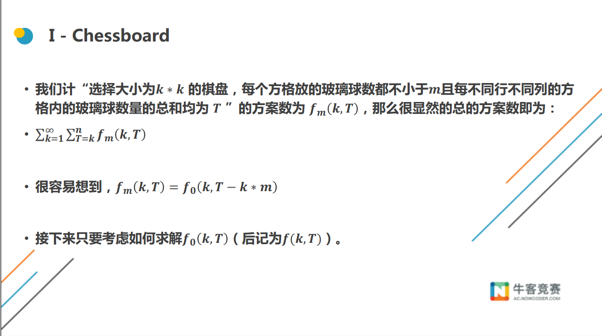
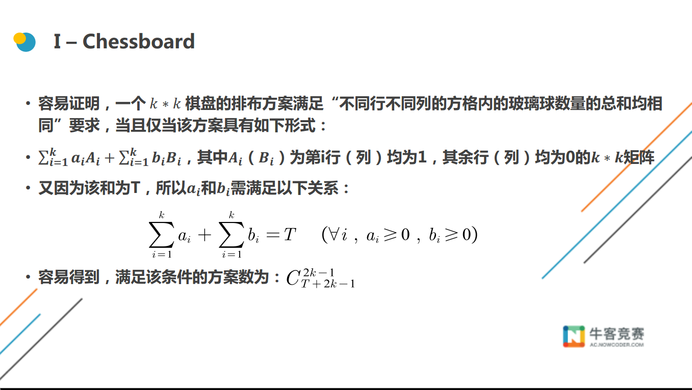

<!--less-->

## H:Pair

### 题意

给你3个数字$A,B,C$,让你计算$1\leq x\leq A,1\leq y\leq B$,并且$(x$ $and$ $y)>C$或者$(x$ $xor$ $y)<C$ 这样的

$<x,y>$有多少对

### 思路

很像数位dp，枚举二进制的每一位，4种状态分别是（A临界，B临界，A$and$B临界，A$xor$B临界）

这样直接数位dp可以算出有多少对不满足条件，然后用总数减去

因为$x,y>1$,所有要在数位dp算出的结果中减去x为0时和y为0时的数量

### AC代码

```c
#include<bits/stdc++.h>
using namespace std;
#define ll long long
ll dp[35][2][2][2][2];
int num_a[35], num_b[35], num_c[35];

void GetNum(ll a, ll b, ll c) {
    memset(num_a, 0, sizeof(num_a));
    memset(num_b, 0, sizeof(num_b));
    memset(num_c, 0, sizeof(num_c));
    num_a[0] = 0;
    while(a) {
        num_a[++num_a[0]] = a % 2;
        a /= 2;
    }
    num_b[0] = 0;
    while(b) {
        num_b[++num_b[0]] = b % 2;
        b /= 2;
    }
    num_c[0] = 0;
    while(c) {
        num_c[++num_c[0]] = c % 2;
        c /= 2;
    }
}

ll dfs(int pos, int a, int b, int an, int xo) {
    if(!pos) return 1;
    if(dp[pos][a][b][an][xo] != -1) return dp[pos][a][b][an][xo];
    int ua = a ? num_a[pos] : 1;
    int ub = b ? num_b[pos] : 1;
    int uan = an ? num_c[pos] : 1;
    int uxo = xo ? num_c[pos] : 0;
    ll ret = 0;
    for (int i = 0; i <= ua; i ++) 
        for (int j = 0; j <= ub; j ++) 
            if((i&j) <= uan && (i^j) >= uxo) 
                ret += dfs(pos-1, a&&(i==ua), b&&(j==ub), an&&((i&j)==uan), xo&&((i^j)==uxo));
    return dp[pos][a][b][an][xo] = ret;
}

int main() {
    int t;
    scanf("%d", &t);
    while(t --) {
        ll a, b, c;
        scanf("%lld %lld %lld", &a, &b, &c);
        GetNum(a, b, c);
        memset(dp, -1, sizeof(dp));
        ll ans = dfs(32, 1, 1, 1, 1) - max(0ll, a-c+1) - max(0ll, b-c+1);
        cout << a*b-ans << endl;
    }
    return 0;
}
```


## I:Chessboard

### 题意

给你一个N，M，然后你可以任意构造一个 k * k的矩阵，使得矩阵内每个元素最少是M，且任意不同行不同列的 k 个元素总和不超过N且都相同，问有多少种构造方法。

### 思路



我们枚举$k$，我们可以把每个元素减去$M$，那么就相当于$N$减去$ k \times M$,简化问题并且不影响答案



构造两个矩阵$Ai,Bi $对于这两个矩阵，我们可知他们前面的系数和为$T$则满足结果  等价于将$T$ 分成$2\times k$份($a$，$b$各有$k$个)采用隔板法 （将$T$ 转换成$1$排，每两个$1$之间有一个隔间，那么$k \times 2 + T$有$k \times 2 - 1 +T$个​隔间，我们选择$k \times 2 - 1$个隔间就可以把这些$1$分成$k \times 2$份


为什么会算重，我们拿$T=3,k=2$来举个例子，比如$a_1=1,a_2=2,b_1=0,b_2=0$

那这个矩阵就是长这个样子

$\begin{bmatrix} a_1+b_1 &a_1+b_2 \\\ a_2+b_1 &a_2+b_2 \end{bmatrix}$ $==>$ $\begin{bmatrix} 1 & 1\\ 2 &2 \end{bmatrix}$

跟$\begin{bmatrix} a_1-1+b_1+1 &a_1-1+b_2+1\\ a_2-1+b_1+1 &a_2-1+b_2+1 \end{bmatrix}$ $==>$ $\begin{bmatrix} 1 & 1\\ 2 &2 \end{bmatrix}$

是相同的，也就是当$a_i$全部减1，而$b_i$全部加1时，跟原来的矩阵相同，所以这就重复了,那去重也就是这样去

PS:这篇博客其实是我扒[CM大佬](https://blog.csdn.net/henucm/article/details/99730917)的=^=

### AC代码

```c
#include<bits/stdc++.h>
using namespace std;
#define ll long long
const int maxn = 1e5 + 5;
const int inf = 0x3f3f3f3f;
const int mod = 998244353;

ll fac[maxn], inv[maxn];

ll Ksm(ll a, ll b, ll p) {
    ll res = 1;
    while(b) {
        if(b & 1) res = res * a % p;
        a = a * a % p;
        b >>= 1;
    }
    return res;
}

void Fac() {
    fac[0] = 1;
    for (int i = 1; i < maxn; i ++) 
        fac[i] = (fac[i-1] * i) % mod;
    inv[maxn-1] = Ksm(fac[maxn-1], mod-2, mod);
    for (int i = maxn-2; i >= 0; i --)
        inv[i] = inv[i+1] * (i+1) % mod;
}

ll C(int n, int m) {
    if(n < 0 || m < 0 || n < m) return 0;
    return fac[n] * inv[m] % mod * inv[n-m] % mod;
}

int main() {
    Fac();
    int T;
    scanf("%d", &T);
    while(T --) {
        int n, m;
        scanf("%d %d", &n, &m);
        ll ans = 0;
        for (int k = 1; k * m <= n; k ++) {
            int tt = n - k*m;
            for (int t = 0; t <= tt; t ++) {
                ans += C(t+k+k-1, k+k-1);
                if(t >= k) ans -= C(t+k-1, k+k-1);
                ans = (ans % mod + mod) % mod;
            }
        }
        printf("%lld\n", ans);
    }
    return 0;
}
```

## K:Function

### 题意

$csl(p,x)= \begin{cases} 3e+1 & x=p^e\& p\in prime \& p = a^2+b^2\\1 & x=p^e \& p!= a^2+b^2\\0 & others\end{cases}$

$tl(p,x)=\max\limits_{d|x}csl(p,d)$

求$S=\sum\limits_{i=1}^{n}\prod\limits_{p} tl(p,i)$

### 思路

可得知

$tl(p,x)=\begin{cases}3e+1& x=p^e\& p\in prime \&p=a^2+b^2 \\1 & others\end{cases}$

$f(x)=\prod\limits_{d|n}\begin{cases}3e+1& x=p^e\& p\in prime \&p=a^2+b^2 \\1 & others\end{cases}$

答案就是$f(i)$的前缀和,即$S=\sum\limits_{i=1}^{n}f(i)$

我们先不考虑$p=a^2+b^2$，考虑$i$为质数时的情况$f(i)=3+1$

$i$为质数次幂的情况$f(p^e)=3e+1$

这样可以快速算出i为质数和i的质数次幂的情况

可以用$min\_25$筛来求这个前缀和

那么现在我们来考虑$p=a^2+b^2$这个限制，因为$min\_25$筛由构造一个函数，把所有数字看成质数，

我们可以设$h[i][4]$，来代表i以前由多少数字余数为$0，1，2，3$，通过dp可以得到有多少质数余数为$0，1，2，3$

因为费马二次定理，我们知道模$4$与$1$的可以分解成$a^2+b^2$，而模$4$余$3$的一定不行，那么质数部分我们就都算出来了，下面的合数部分就用$min\_25$筛就好了

### AC代码

```c
#include<bits/stdc++.h>
using namespace std;

#define ll long long
const int maxn = 1e5 + 7;
const int inf = 0x3f3f3f3f;
const int mod = 1e9 + 7;
typedef pair<int, int> pis;

ll sum[maxn][4], prime[maxn], tot, h[maxn][4];
ll w[maxn], m, id1[maxn], id2[maxn];
ll sqr;
bool vis[maxn];

ll f(ll p, ll e) {
    if(p % 4 == 1) return 3 * e + 1;
    return 1;
}

ll init(ll n) {
    for (int i = 0; i < 4; i ++) sum[0][i] = 0;
    for (int i = 1; i <= n; i ++) vis[i] = 0;
    vis[1] = 1; tot = 0;
    for (int i = 2; i <= n; i ++) {
        if(!vis[i]) {
            prime[++tot] = i;
            for (int j = 0; j < 4; j ++) 
                sum[tot][j] = sum[tot-1][j] + (i % 4 == j);
        }
        for (int j = 1; j <= tot; j ++) {
            if(i * prime[j] > n) break;
            vis[i*prime[j]] = 1;
            if(i % prime[j] == 0) break;
        }
    }
}

void getW(ll n) {
    m = 0;//离散下标
    for (ll l = 1, r; l <= n; l = r + 1) {
        r = n/(n/l);
        w[++m] = n/l;//把所有数字当成质数
        h[m][1] = w[m] / 4 + (w[m] % 4 >= 1) - 1;
        h[m][2] = w[m] / 4 + (w[m] % 4 >= 2);
        h[m][3] = w[m] / 4 + (w[m] % 4 >= 3);
        h[m][4] = w[m] / 4;
        if(w[m] <= sqr) id1[w[m]] = m;
        else id2[n/w[m]] = m;
    }
}

void getG(ll n) {//dp都质数模4的个数
    for (ll i = 1; i <= tot; i ++) {
        for (ll j = 1; j <= m && prime[i] * prime[i] <= w[j]; j ++) {
            ll d = w[j] / prime[i];
            ll id = d <= sqr ? id1[d] : id2[n/d];
            for (int r = 0; r < 4; r ++) 
                h[j][r*prime[i]%4] = h[j][r*prime[i]%4] - h[id][r] + sum[i-1][r];
        }
    }
}

ll S(ll x, ll y, ll n) {
    if(x <= prime[y-1] || x <= 1) return 0;
    ll id = x <= sqr ? id1[x] : id2[n/x];
    ll ans = h[id][3] - sum[y-1][3] + 4 * (h[id][1] - sum[y-1][1]);//模4余1的值为4，余3的值为1
    if(y == 1) ans ++;
    for (ll i = y; i <= tot && prime[i] * prime[i] <= x; i ++) {
        ll t = prime[i];
        for (int j = 1; t <= x; j ++, t = t * prime[i]) 
            ans = ans + f(prime[i], j) * (S(x/t, i+1, n) + (j != 1));
    }
    return ans;
}

int main() { 
    int t;
    scanf("%d", &t);
    while(t --) {
        ll n;
        scanf("%lld", &n);
        sqr = sqrt(n);
        init(sqr);
        getW(n);
        getG(n);
        printf("%lld\n", S(n, 1, n) + 1);//S(n,1,n)+f(1)
    }
    return 0;
}
```

